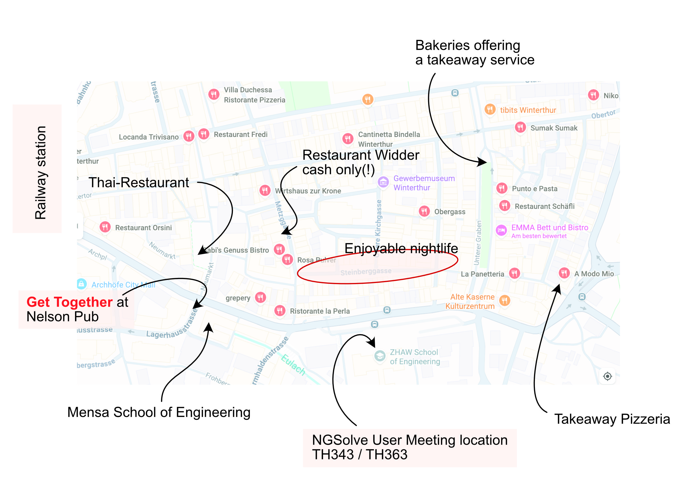

# Lunch Break

There are plenty of great places to eat and relax in Winterthur:

* **Lunch in the Old Town:** You'll find numerous restaurants just a short walk away.
* **On Campus:** The [School of Engineering’s canteen](https://www.zfv.ch/de/essen-gehen/zhaw-cafeteria-mensa-eulachpassage#contact) is located in the TN building and offers a convenient lunch option.
* **Evening Chill:** For a cosy atmosphere later in the day, head over to Steinberggasse.

